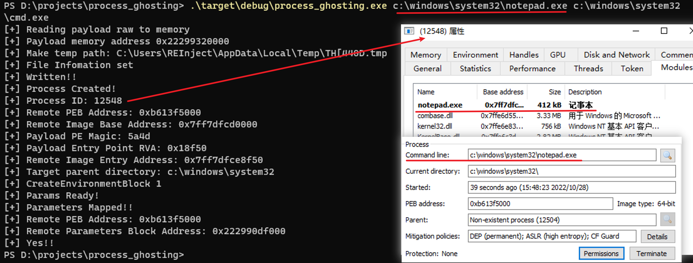
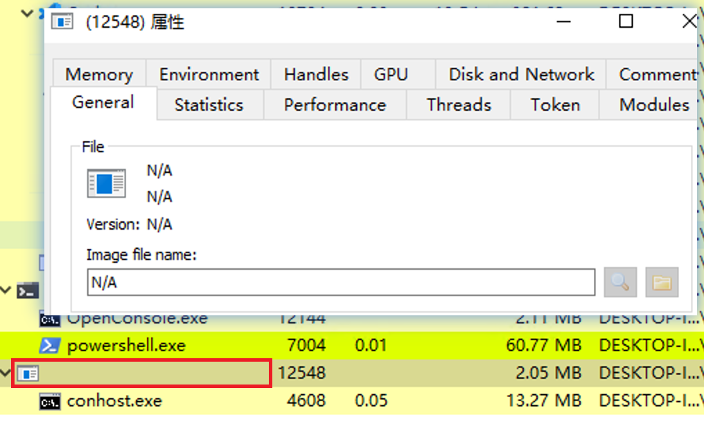
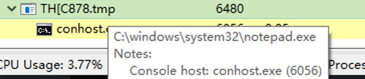

# Process Ghosting

这个是根据 [hasherezade/process_ghosting](https://github.com/hasherezade/process_ghosting) 项目改的 rust 版本代码。

## 编译方法

```bash
cargo build
```

## 使用方法

```bash
process_ghosting.exe <target_path> <payload_path>
```



## 技术原理

参考：[https://www.elastic.co/blog/process-ghosting-a-new-executable-image-tampering-attack](https://www.elastic.co/blog/process-ghosting-a-new-executable-image-tampering-attack)

大致利用步骤：

1. 创建一个文件，需具有 DELETE 权限
2. 调用 NtSetInformationFile 将 FILE_DISPOSITION_INFO 的 DeleteFile 设置为 TRUE
3. 写恶意内容到该文件中，由于该文件当前是 delete-pending 状态，外部无法打开此文件
4. 用这个文件创建一个 IMAGE 内存段
5. 关闭文件句柄，该文件会被自动删除
6. 使用 IMAGE 段创建进程，该进程磁盘上无文件对应
7. 设置进程参数和环境变量信息
8. 为这个进程创建一个线程执行恶意内容

在最后一步的时候，会触发进程创建内核回调，进程在磁盘上无文件与之对应，可让一些静态检测引擎失效。

该技术除了使用 delete_on_close 文件自删除机制之外，还需配合进程命令行参数伪造技术一起使用。

## 遗留问题

因为创建的进程属于无文件进程，在进程管理器里看着很怪异，暂时无法解决，不过单纯用来绕过静态进程文件扫描还是不错的。



这个问题已经解决，解决过程：

简单看了一下 windows 进程管理器获取进程名并不是通过 PEB，而是在进程创建时根据 section_handle 信息确定的，由于在原项目中创建进程的时候文件已经被删除，无法获取到文件信息导致进程名为空了，解决方法很简单，就是在创建进程之后再关闭文件句柄，但是这样子就可以查出来进程对应的具体文件路径，所以这里还是留空吧。



可能 hasherezade 也觉得不满意，又结合 ProcessHollowing 技术写了个项目 [hasherezade/transacted_hollowing](https://github.com/hasherezade/transacted_hollowing) 解决了这个问题，她把 ProcessHollowing 和 ProcessGhosting 两个技术稍微结合了一下：参照 ProcessHollowing 技术先创建一个正常程序的挂起进程，然后使用 ProcessGhosting 里的方式制作一个无文件的 section，map 到目标进程中，再更新 PEB 后恢复线程即可。
